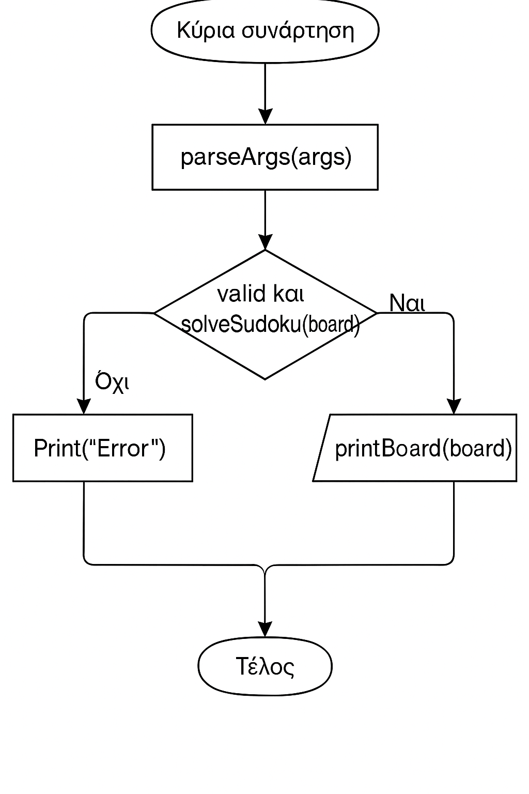

# 🧩 Sudoku Solver in Go

Αυτό το πρόγραμμα επιλύει Sudoku puzzles χρησιμοποιώντας αναδρομικό αλγόριθμο backtracking. Υλοποιείται στη γλώσσα Go και διαβάζει το αρχικό puzzle από τα ορίσματα της γραμμής εντολών.

---

> 📘 **Διαβάστε το πλήρες [Manual Χρήσης](docs/Sudoku_Manual.pdf)** για οδηγίες εγκατάστασης και χρήσης.

## 📦 Λειτουργία

Το πρόγραμμα:

1. **Διαβάζει** είσοδο από τη γραμμή εντολών (`os.Args`)
2. **Ελέγχει εγκυρότητα** της εισόδου και μετατρέπει το puzzle σε πίνακα 9x9
3. **Επιλύει** το Sudoku χρησιμοποιώντας αναδρομική αναζήτηση (backtracking)
4. **Εκτυπώνει** τη λύση ή εμφανίζει σφάλμα αν το puzzle δεν είναι επιλύσιμο

---

## 📐 Δομή Κώδικα

- `main()`  
  Εκκινεί το πρόγραμμα και χειρίζεται την είσοδο/έξοδο.

- `parseArgs(args []string)`  
  Επεξεργάζεται τα ορίσματα και τα μετατρέπει σε πίνακα `[9][9]int`.

- `solveSudoku(*[9][9]int)`  
  Αναδρομική λύση με χρήση backtracking.

- `isValid(board, row, col, num)`  
  Ελέγχει αν μια τιμή μπορεί να τοποθετηθεί σε κελί.

- `printBoard(board)`  
  Εκτυπώνει τον πίνακα με χρήση της βιβλιοθήκης `z01`.

---

## 🔧 Εκτέλεση

Για να το τρέξετε:

```bash
go run sudoku.go ".96.4...1" "1...6...4" "5.481.39." "..795..43" ".3..8...." "4.5.23.18" ".1.63..59" ".59.7.83." "..359...7"
```

Κάθε γραμμή εισόδου πρέπει να έχει **9 χαρακτήρες**, όπου `.` δηλώνει κενό κελί.

---

## 📊 Διάγραμμα Ροής (main function)

Το παρακάτω διάγραμμα παρουσιάζει τη βασική ροή της κύριας συνάρτησης:



---

## 📜 Άδεια

MIT License
